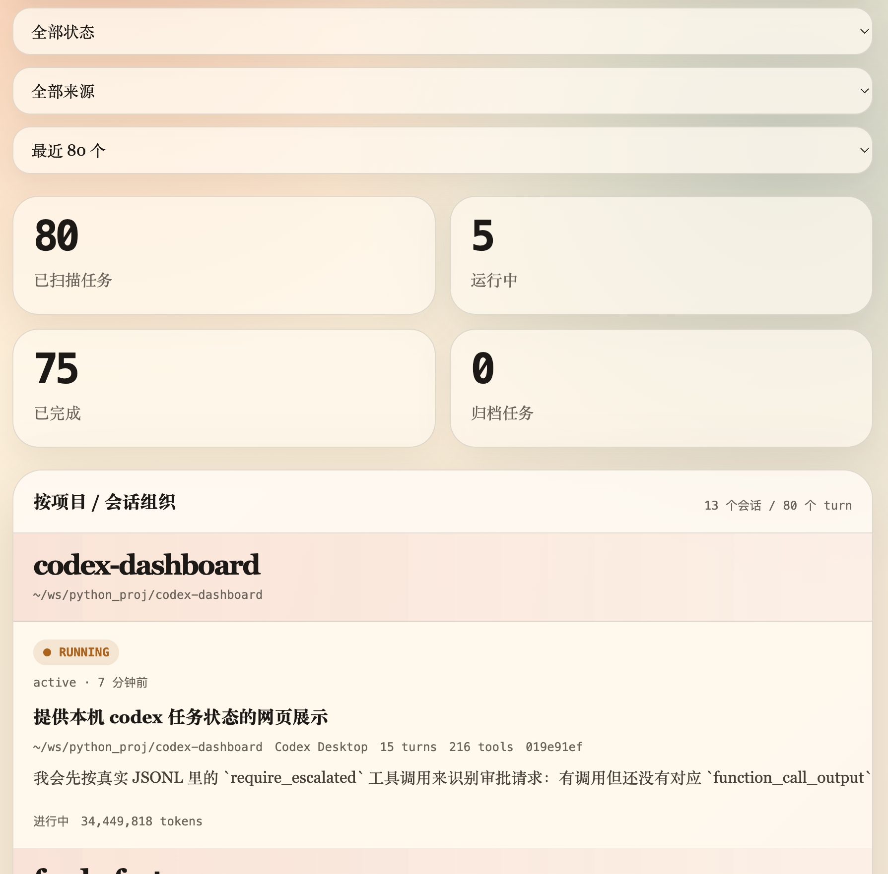

# codex-dashboard

本机 Codex 任务状态 Dashboard。它基于 FastAPI + Jinja2 模板实现，前端使用 Lit Web Components 组件化，直接读取 `~/.codex/sessions` 和 `~/.codex/archived_sessions` 下的 rollout JSONL，不依赖外部数据库。



## 功能

- 按项目和会话组织 Codex 状态，同一个会话只展示一次。
- 展示权限审批请求数量，能标出尚未收到 `function_call_output` 的待审批任务。
- 会话标题来自该会话的第一个用户输入，单行截断，完整内容可通过鼠标悬停查看。
- 点击会话卡片可查看该会话的用户与 Codex 对话记录。
- 后端使用 Pydantic model 描述任务与会话响应结构。
- Lit 组件拆分在 `static/components/` 下，页面直接用原生 ES Modules 加载源码；修改 JS 后刷新即可生效，不需要打包步骤。
- 显示用户输入、最近回复、工作目录、会话来源、耗时、token 和工具调用数量。
- 支持搜索 prompt / cwd / 回复 / 审批说明，按状态、待审批状态和归档来源过滤。
- 浏览器页面每 15 秒自动刷新，适合放在本机常驻查看。

## 启动

```bash
uv run codex-dashboard
```

默认监听：`http://127.0.0.1:8765`

可选参数：

```bash
uv run codex-dashboard --host 127.0.0.1 --port 8765 --codex-home ~/.codex
```

首次使用可先同步环境：

```bash
uv sync
```

## API

```bash
curl 'http://127.0.0.1:8765/api/tasks?limit=80'
```

查看某个会话的对话记录：

```bash
curl 'http://127.0.0.1:8765/api/session?file=/path/to/rollout.jsonl'
```

返回结构包含：

- `summary`：总数、状态分布、来源分布、审批分布、活跃工作区。
- `tasks`：每个 Codex turn 的状态、cwd、prompt、最近回复、工具调用、审批请求与 token 信息。
- `messages`：会话详情接口返回的用户与 Codex 对话记录。

## 说明

Dashboard 只做只读扫描，不会修改 Codex 本地文件。任务状态来自 JSONL 事件：看到 `task_started` 且还没有对应 `task_complete` 时显示为 `running`；权限审批来自 `require_escalated` / `with_escalated_permissions` 工具调用，若还没有对应 `function_call_output` 则显示为待审批。
